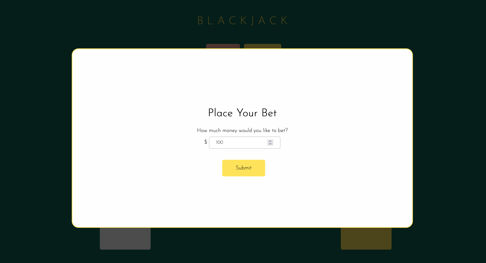
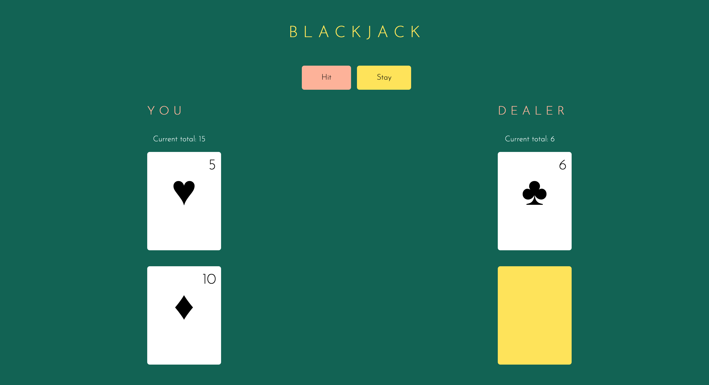
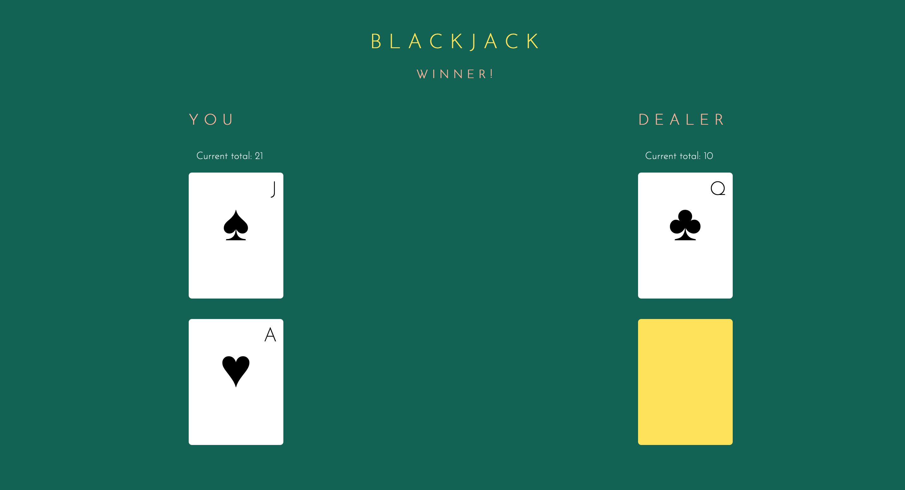
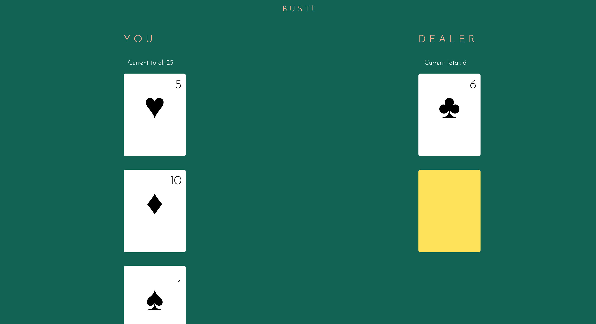
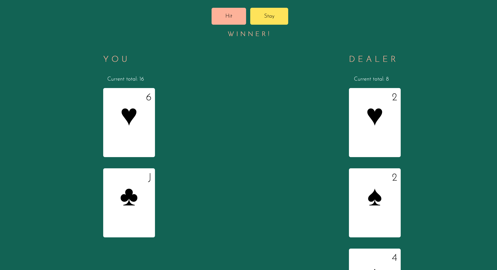
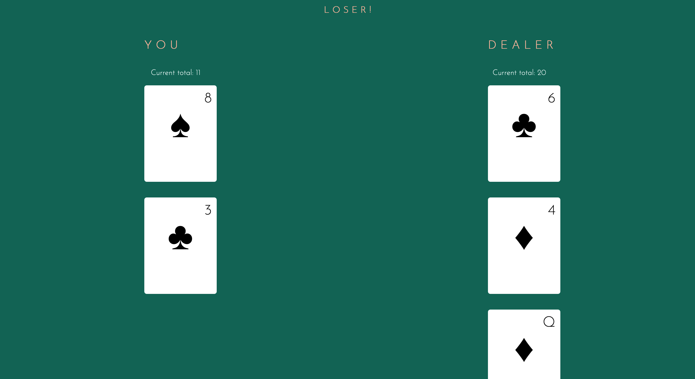

# dgmd-e-28-assignment-3

## Task 1

### Method 1: Associative Array of Items and Prices

- [x] Present the order choices to the user
- [x] Get the order quantities desired for each item
- [x] Calculate the order total
- [x] Display the order plus the total

### Method 2: Simple Object Format

- [x] Present the order choices to the user
- [x] Get the order quantities desired for each item
- [x] Calculate the order total
- [x] Display the order plus the total

### Method 3: Function Objects

- [x] Present the order choices to the user
- [x] Get the order quantities desired for each item
- [x] Calculate the order total
- [x] Display the order plus the total

### Method 4: Classes

- [x] Present the order choices to the user
- [x] Get the order quantities desired for each item
- [x] Calculate the order total
- [x] Display the order plus the total

## Task 2

### Blackjack

**Objective**
Have a hand that totals higher than the dealers' but doesn't total to higher than 21.

**Namesake**
An ace and a ten card are 21 in two cards, which is called Blackjack/Natural.

**Value of Cards**

- _Number cards:_ The number is the value of the card.
- _Face cards:_ The value of face cards is 10.
- _Ace:_ In the initial draw it is valued at 11 unless it causes you to bust-then it is valued at 1. In subsequent turns it is valued at 1.

**Rules**

- The game starts with you placing a bet.
- The dealer deals you 2 cards face up and deals themselves 1 card face up and 1 card face down.
- If the total of your 2 cards is 21, then you automatically win.
- You can then either choose to "Hit" or "Stay" by clicking the corresponding button.
- When you click "Hit", you will be dealt another card. There's no limit to how many cards you can ask for but if you hit higher than 21, then you bust.
- If you click "Stay", then the dealer will reveal their second card. If the dealer totals at 16 or under, they have to take another card. If its 17 or higher they have to stay with their hand.
- If the dealer busts, then you win. If the dealer doesn't bust, then you only win if your cards are higher than the dealers' cards.

**Requirements**

Create a page that implements the game of blackjack in which a
player plays against a dealer. It will be your choice how to implement the game given the
following requirements:

- [x] You must use objects
- [x] You must use arrays
- [x] The card suit (diamond, heart, spade, club) must be displayed as an icon or image.
- [x] The player has their hand of cards plus a “wallet” of money they can use to bet
- [x] You may use events and any other means of input

**Screenshots**

User placing a bet from the money in their wallet

Initial screen shows the user with 2 faceup cards and the dealer with 1 faceup and 1 facedown card; the totals of both the player and the dealer are shown at the top

Scenario where the user got Blackjack on initial draw (total of 21 on the first 2 cards)

Scenario where the user chose "Hit" and then bust

Scenario where user chose "Stay" and won

Scenario where user chose "Stay" and lost

