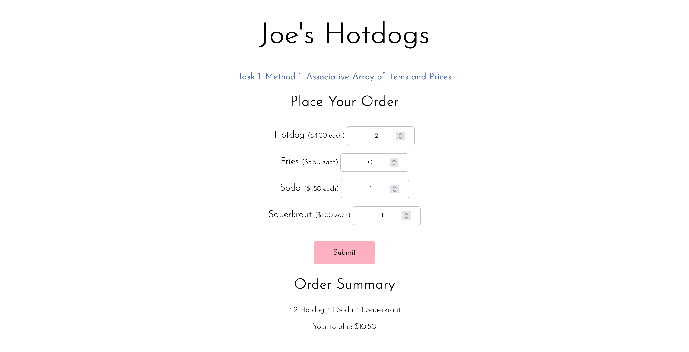
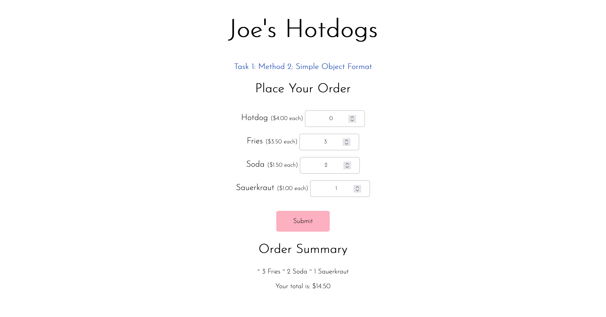
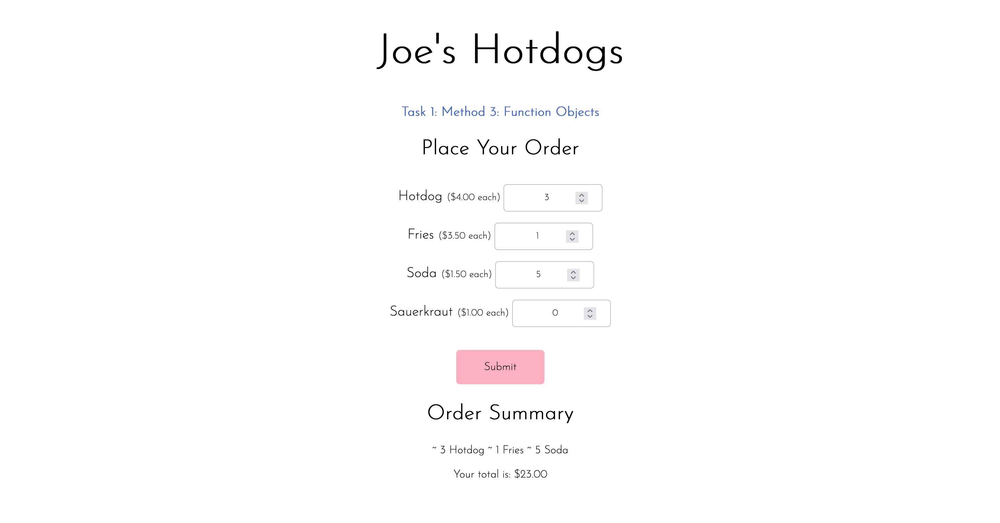
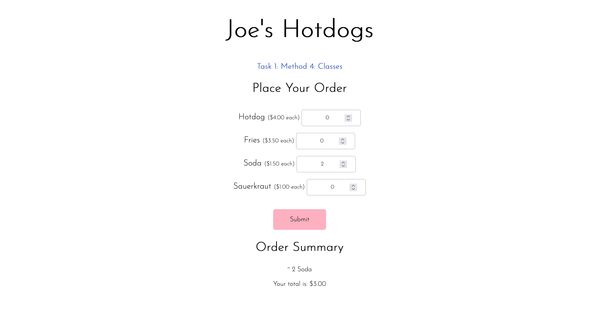

# dgmd-e-28-assignment-3

## Task 1

### Method 1: Associative Array of Items and Prices

- [x] Present the order choices to the user
- [x] Get the order quantities desired for each item
- [x] Calculate the order total
- [x] Display the order plus the total

### Method 2: Simple Object Format

- [x] Present the order choices to the user
- [x] Get the order quantities desired for each item
- [x] Calculate the order total
- [x] Display the order plus the total

### Method 3: Function Objects

- [x] Present the order choices to the user
- [x] Get the order quantities desired for each item
- [x] Calculate the order total
- [x] Display the order plus the total

### Method 4: Classes

- [x] Present the order choices to the user
- [x] Get the order quantities desired for each item
- [x] Calculate the order total
- [x] Display the order plus the total

## Task 2

### Blackjack

**Objective**
Have a hand that totals higher than the dealers' but doesn't total to higher than 21.

**Namesake**
An ace and a ten card are 21 in two cards, which is called Blackjack/Natural.

**Value of Cards**

- _Number cards:_ The number is the value of the card.
- _Face cards:_ The value of face cards is 10.
- _Ace:_ Either 1 or 11. It is counted as 11 generally unless it would put you over 21, in which case it counts as 1.

**Rules**

- The game starts with you (not the dealer) placing a bet.
- The dealer will then deal 1 card face up to you, the player, and will deal 1 card face up to themselves.
- You are then dealt another card face up. The dealer will deal another card to themselves but face down.
- If the total of your 2 cards is 21, then you automatically win one and a half times your bet and you're done for that round.
- Otherwise, the dealer will ask whether you want another card from the deck. If you do, say "Hit". If you don't want any more cards, say "Stay".
- There's no limit to how many cards you can ask for but if you hit higher than 21, then you bust.
- If you stay, then the dealer will reveal their second card. If its 16 or under, they have to take another card. If its 17 or higher they have to stay with their hand.
- If the dealer busts, then the player (you) will win twice your bet. If the dealer doesn't bust, then only the players whose cards are higher than the dealer wins twice their bet. Everyone else loses their initial bet.
- Then new round begins.

Counting Poker / Gambling Chips

Basic Poker Chip Colors and Standard Values
White, $1
Red, $5
Blue, $10
Green, $25
Black, $100

### Requuirements

Your second task is to create a page that implements the game of blackjack in which a
player plays against a dealer. It will be your choice how to implement the game given the
following requirements:

1. You must use objects
2. You must use arrays
3. The card suit (diamond, heart, spade, club) must be displayed as an icon or image.
4. The player has their hand of cards plus a “wallet” of money they can use to bet
5. You may use events and any other means of input
